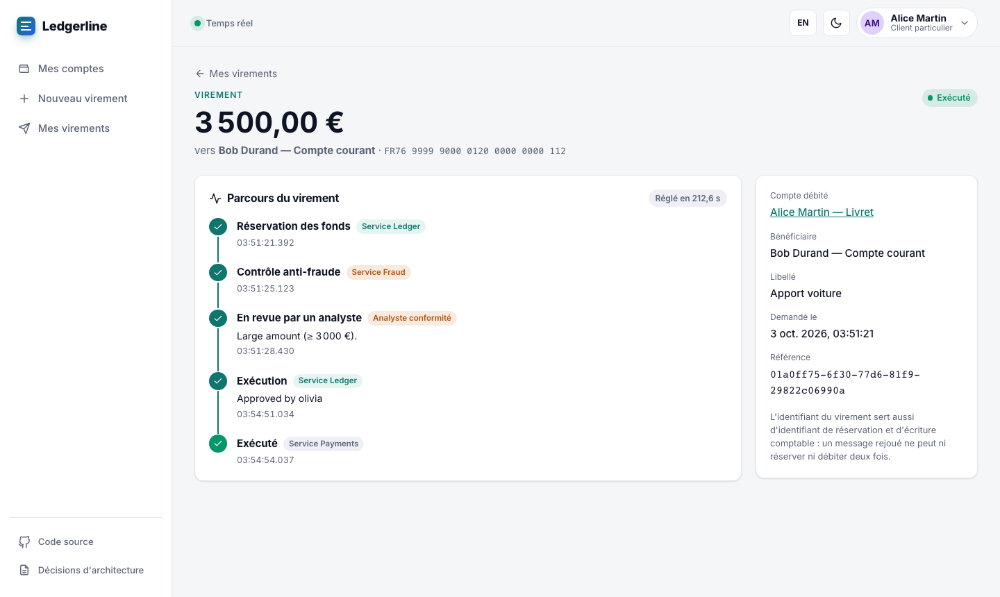
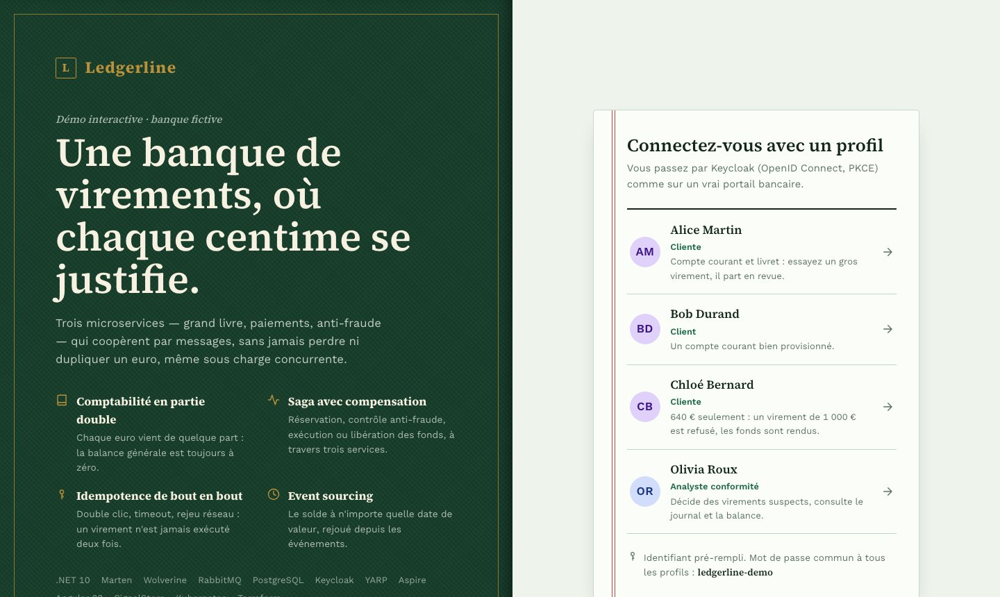
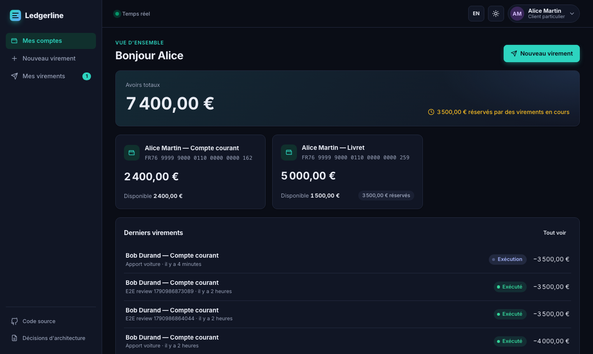
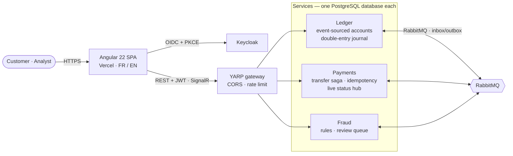
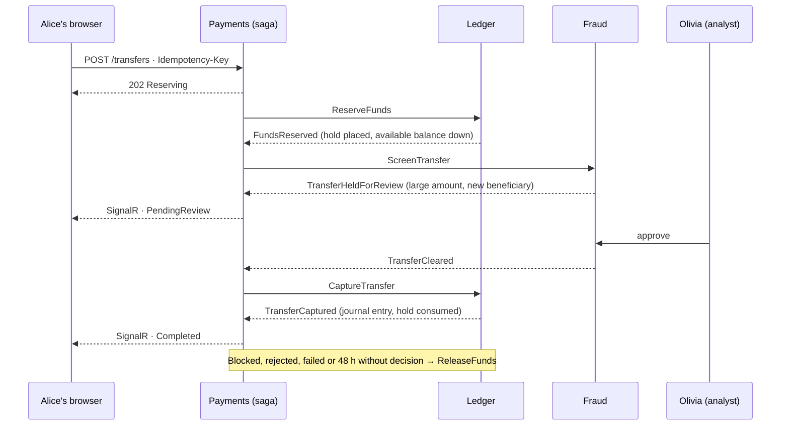

<div align="center">

# Ledgerline

**A transfer bank as three .NET microservices — event sourcing · saga · Kubernetes · Angular 22**

A double-entry ledger, a payments saga and a fraud desk that cooperate through RabbitMQ — and never lose, create or
duplicate a cent, even with 25 transfers per second hammering the same two accounts.

[**▶ Live demo**](https://ledgerline-bank.vercel.app) · [Architecture decisions](docs/adr/README.md) · [What the load test found](docs/performance.md) · [Français](#-en-français)

[](https://github.com/JASSBR/ledgerline/actions/workflows/ci.yml)
[](https://github.com/JASSBR/ledgerline/actions/workflows/codeql.yml)


[](LICENSE)



<table>
  <tr>
    <td width="50%"></td>
    <td width="50%"></td>
  </tr>
  <tr>
    <td align="center"><sub>Sign-in: the ledger's cover and its first ruled page</sub></td>
    <td align="center"><sub>Accounts, dark theme</sub></td>
  </tr>
</table>

</div>

## Try it in 3 minutes

1. Open the [live demo](https://ledgerline-bank.vercel.app) and sign in as **Alice** — through a real Keycloak login
   (password `ledgerline-demo`, shown on the page).
2. Send **3 500 €** from her savings account to **Bob**. The page shows the transfer crossing the services live: funds
   held by the Ledger, screened by Fraud… and **held for review** (large amount, new beneficiary). Her available balance
   drops; her ledger balance does not.
3. In a second window, sign in as **Olivia** (compliance analyst). The transfer is waiting in her queue with the rules
   that fired. Approve it — Alice's page completes on its own.
4. As **Chloé** (640 €), send 1 000 €: the Ledger refuses the hold, nothing else happens. As **Bob**, pay *Société
   Écran SARL*: blocklisted, the funds are released.
5. As Olivia, open the **trial balance**: every account sums to exactly **0,00 €**. Open Chloé's account and
   **freeze** it with a reason: her next transfer is refused by the Ledger, while money sent to her still lands.
6. Keep a window signed in as Alice while Bob pays her: a **« Virement reçu »** notice appears and her balance updates
   on its own. **Movements** shows everything in and out, month by month, exportable as CSV.

> The demo scales to zero when idle: the first sign-in after a quiet period can take half a minute while Keycloak and
> the services start.

## What a reviewer should look at

| If you care about… | Look at |
|---|---|
| **Domain modelling** | [`Account.cs`](src/Services/Ledger/Ledgerline.Ledger.Domain/Account.cs), [`JournalEntry.cs`](src/Services/Ledger/Ledgerline.Ledger.Domain/JournalEntry.cs): pure deciders, money in cents, holds vs postings, double entry — [ADR 0003](docs/adr/0003-event-sourced-ledger.md) |
| **Distributed consistency** | The [`Transfer` saga](src/Services/Payments/Ledgerline.Payments/Handlers/Transfer.cs): hold → screen → capture, or release; a scheduled review deadline — [ADR 0004](docs/adr/0004-transfer-saga-with-holds.md) |
| **Exactly-once effects** | `Idempotency-Key` with request fingerprint, transfer id = hold id = entry id, durable inbox/outbox — [ADR 0005](docs/adr/0005-idempotency-end-to-end.md) |
| **Concurrency** | Stream locks in account order after the load test showed optimistic retries running out and deadlocks — [ADR 0003](docs/adr/0003-event-sourced-ledger.md), [performance](docs/performance.md) |
| **Event sourcing** | Statements, **balance at any value date** and the account's **event history** (the audit trail *is* the stream), all replayed from the account's events |
| **Back-office controls** | Account **freeze** as a ledger event, enforced where money leaves, under the same stream lock — [ADR 0011](docs/adr/0011-account-freeze-and-audit-trail.md) |
| **Correctness proofs** | A [CsCheck property](tests/Ledgerline.Ledger.Domain.Tests): thousands of random operation sequences never create money or overdraw |
| **Security** | Keycloak OIDC + PKCE, policies enforced in every service, 404 for others' accounts, YARP gateway with rate limiting — [SECURITY.md](SECURITY.md) |
| **Kubernetes** | [`deploy/k8s`](deploy/k8s): restricted Pod Security, read-only root FS, default-deny NetworkPolicies, probes; **deployed on kind in CI** with the E2E suite run against it |
| **Infrastructure as code** | [`deploy/terraform`](deploy/terraform): Container Apps, managed identity for image pulls, PostgreSQL — [ADR 0009](docs/adr/0009-deployment-topologies.md) |
| **Modern Angular** | Zoneless, signals, `httpResource`, Signal Forms, **NgRx SignalStore** fed by SignalR, compiled FR/EN builds — [ADR 0008](docs/adr/0008-frontend-live-saga.md) |

## Architecture





```
src/
  Ledgerline.AppHost/        .NET Aspire: PostgreSQL, RabbitMQ, Keycloak, 3 services, gateway, Angular — one command
  Ledgerline.Gateway/        YARP: routes, CORS, per-IP rate limiting, security headers, WebSockets
  Ledgerline.Hosting/        the shared service skeleton: Marten, Wolverine, RabbitMQ routing, JWT, retries
  Ledgerline.Contracts/      messages between services — records of primitives only (architecture-tested)
  Services/Ledger/           Domain (pure) + service: accounts, holds, journal, statements, trial balance
  Services/Payments/         Domain + service: transfer saga, idempotency, SignalR hub
  Services/Fraud/            Domain + service: configurable rules, blocklist, analyst decisions
tests/                       domain + properties · saga · architecture · integration (Testcontainers) · k6 load
web/                         Angular 22: Vitest unit tests, Playwright E2E through Keycloak
deploy/                      k8s (Kustomize, kind script) · terraform (Azure) · keycloak realm · deploy scripts
docs/                        10 ADRs · performance
```

## Run it locally

Prerequisites: .NET SDK 10, Node 24 (`nvm use`), Docker.

```bash
cd web && npm ci && cd ..
dotnet run --project src/Ledgerline.AppHost      # everything, wired, with traces across HTTP and RabbitMQ
./deploy/k8s/kind.sh                             # or: the same system on a local Kubernetes cluster
./tests/load/run-in-kind.sh                      # then load it, and check the books afterwards
```

## Quality gates

Every push runs [CI](.github/workflows/ci.yml) and [CodeQL](.github/workflows/codeql.yml):

| Gate | |
|---|---|
| Build | analyzers (Meziantou, Sonar, CA) with warnings as errors, `dotnet format`, Prettier, ESLint (OnPush enforced) |
| Backend tests | **80** — domain + property-based, saga, architecture, integration on real PostgreSQL **and RabbitMQ**; **85 %** line coverage, gate at 80 % |
| Frontend tests | **75** Vitest tests, **96 %** statements, thresholds enforced |
| Kubernetes | images built, deployed on **kind** with Kustomize, smoke-tested through the gateway with a Keycloak token |
| End-to-end | **4** Playwright scenarios through the real login, against the Kubernetes deployment |
| Infrastructure | `terraform fmt` + `validate` |
| Supply chain | vulnerable NuGet/npm packages fail the build, Dependabot, CodeQL |

## What the load test found

The first k6 runs against the Kubernetes deployment failed — and each failure was a production defect that every
other test had missed: a PostgreSQL connection storm, deadlocks between opposite transfers, optimistic retries running
out on a hot account (leaving funds held), and services using 410 MB each because handler code was compiled at startup.
All four were fixed in the code; the final run settles **1 500 transfers on the same two accounts with 0 errors, 0 dead
letters and books at exactly zero** — [details](docs/performance.md).

## How it was built

With Claude Code and the [ECC](https://github.com/affaan-m/ECC) agent harness: C#/Angular rules, the `csharp-reviewer`
agent, TDD and verification loops, and hooks that format every edit and refuse to stop on a red build
([`.claude/`](.claude)). Its companion project, [ClaimFlow](https://github.com/JASSBR/claimflow), takes the opposite
architectural bet — a modular monolith — on a different domain.

## 🇫🇷 En français

Ledgerline est une banque de virements fictive en trois microservices .NET : un grand livre en partie double et en
event sourcing, une saga de paiement avec réservation et compensation, et un service anti-fraude avec revue par un
analyste. Gel de compte par un opérateur (motif obligatoire, inscrit dans l'historique du compte), mouvements
entrées/sorties avec export CSV, notification « virement reçu » en direct. Idempotence de bout en bout, authentification Keycloak (OIDC + PKCE), suivi du virement en temps réel,
déploiement Kubernetes validé en CI et Terraform pour Azure. Interface en français et en anglais.
[Essayer la démo](https://ledgerline-bank.vercel.app/fr/).
